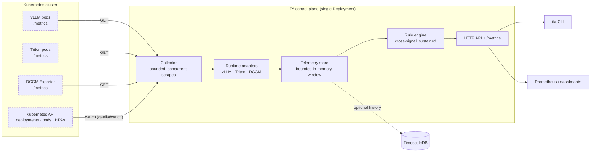

# Inference Fabric Autopilot

**Read-only diagnostics for LLM inference workloads on Kubernetes.** It reads what vLLM and Triton already expose, combines those signals with Kubernetes state, and tells you *which* problem a workload has — not just that a number crossed a line.

[](https://github.com/pm32900/inference-fabric-autopilot/actions/workflows/ci.yml)
[](https://pkg.go.dev/github.com/pm32900/inference-fabric-autopilot)
[](https://goreportcard.com/report/github.com/pm32900/inference-fabric-autopilot)
[](./LICENSE)


---

## The problem

Your inference workload has a deep request queue. Prometheus told you so. What do you do?

It depends entirely on a signal that is not in the alert. If the GPU is saturated, you need capacity — and raising the concurrency limit will make it worse. If the GPU is idle, you have an admission or batching limit — and adding replicas will burn budget without touching the queue. Same metric, same threshold, opposite fixes.

That pattern repeats across inference. A KV cache at 97% is not a problem; a KV cache at 97% *that is preempting requests* is. A slow time-to-first-token caused by queueing needs replicas; the same number caused by prefill needs chunked prefill and prefix caching, and replicas will not help. Dashboards show you all of these numbers. Deciding which situation you are in is left to whoever is on call.

## What this does

IFA scrapes the runtime metrics you already have, joins them with Kubernetes replica state, and evaluates rules that **combine signals and require conditions to persist**. Each finding names the rule that produced it, the measurements that triggered it, and the thresholds they were compared against, so you can disagree with it without reading the source.

```
[WARNING]   IFA-CAP-002  Requests queueing while the GPU is idle
  workload:  inference/embeddings-bge (vllm)
  why:       29 requests have been waiting for 5s while GPU utilisation stayed below 35%.
             The accelerator has capacity that the scheduler is not handing work to —
             typically a concurrency cap (max_num_seqs), a batch-size limit, or a
             per-request memory reservation that is far larger than the requests need.
  action:    Raise the runtime's concurrency limit (max_num_seqs for vLLM) or its batch
             size, and check max_model_len — an oversized value reserves KV blocks per
             sequence and caps how many can run at once. Adding replicas will not help
             here.
  evidence:
             requests_waiting = 29.40 requests (> 8)  ← vllm:num_requests_waiting
             gpu_utilization_percent = 12 percent (< 35)
             kv_cache_usage_percent = 8.34 percent  ← vllm:kv_cache_usage_perc
  sustained: 5s
```

## Try it in 60 seconds

No cluster, no GPU, no vLLM deployment:

```bash
git clone https://github.com/pm32900/inference-fabric-autopilot
cd inference-fabric-autopilot
make demo
```

`make demo` stands up seven simulated inference workloads that serve **real vLLM-format Prometheus exposition over HTTP** — vLLM's metric names, vLLM's histogram bucket boundaries — and points the actual collector at them. The parser, the histogram quantile estimation, the counter-to-rate conversion and the rule engine are all the code that ships. Nothing is pre-canned.

```
WORKLOAD                      RUNTIME  RUNNING  WAITING  KV%   GPU%  TTFT-P95  E2E-P95  TOK/S  AGE
inference/assistant-qwen-14b  vllm     30       77       82.7  94    6.91s     15.67s   706    0s
inference/batch-scoring       vllm     26       33       77.1  96    4.39s     10.49s   1408   0s
inference/chat-llama3-8b      vllm     8        2        64.8  65    243ms     4.49s    908    0s
inference/embeddings-bge      vllm     2        29       8.3   12    4.65s     4.80s    61     0s
inference/legacy-serving      vllm     4        1        -     -     -         -        -      0s
inference/rag-llama3-70b      vllm     6        0        60.4  92    8.00s     25.33s   89     0s
inference/summarise-mixtral   vllm     16       7        97.9  89    2.13s     35.27s   434    0s

A dash means the runtime did not report that metric. It is not a zero.

15 finding(s): 3 critical, 9 warning, 3 info
```

One of those seven is healthy and produces nothing. The others each demonstrate a different diagnosis — capacity shortage, admission misconfiguration, KV-cache exhaustion, prefill-bound latency, an autoscaler at its ceiling, and a runtime whose telemetry is too sparse to judge. [The end-to-end test](internal/demo/demo_test.go) asserts each one still reproduces its failure mode, so the demo cannot quietly rot.

## Why not just Prometheus and Grafana?

You should have both; IFA reads the same data. The difference is what happens after the number moves.

| | Prometheus alert rules | IFA |
|---|---|---|
| Deep queue | one alert, one threshold | separates *GPU saturated* from *GPU idle* — opposite fixes |
| KV cache at 97% | fires, whether or not it matters | reports the preemption rate, which is what actually hurts |
| Slow TTFT | one alert | splits queueing time from prefill time and names the fix for each |
| Missing metrics | silence, indistinguishable from health | an explicit "telemetry incomplete" finding |
| Output | "value > threshold" | rule code, evidence, threshold, and a suggested action |

The honest boundary: IFA has no query language, no long-range history worth speaking of, no alerting pipeline, and no dashboards. It is a diagnostic layer that sits beside your monitoring stack, not a replacement for it. If your question is "what did p95 look like last Tuesday", use Prometheus.

## Architecture



Dashed boxes are read-only: IFA issues GETs and watches, and holds no verb that can change anything. [docs/ARCHITECTURE.md](docs/ARCHITECTURE.md) covers the execution model, failure behaviour and extension points.

## What it reads

| Source | Signals |
|---|---|
| **vLLM** | running/waiting requests and *why* they are waiting, KV-cache utilisation, preemptions, TTFT / end-to-end / queue-time histograms, prompt and generation token counters, prefix-cache hit rate, finished-request reasons |
| **Triton** | pending requests, success and failure counters by reason, GPU utilisation and memory, latency summaries when enabled |
| **DCGM Exporter** | real GPU utilisation, framebuffer usage, temperature — the only source of these; no inference runtime reports them |
| **Kubernetes** | desired/ready replicas, HPA ceilings, container restart counts |

Metric names, units and version differences are documented in [docs/RUNTIMES.md](docs/RUNTIMES.md), along with what has and has not been validated against a live server.

## Rules

Nineteen rules across seven families. Each has a permanent code, a severity, and a documented trigger:

| Code | Fires when | Severity |
|---|---|---|
| `IFA-CAP-001` | Sustained queue **and** saturated GPU — out of compute | warning |
| `IFA-CAP-002` | Sustained queue **and** idle GPU — admission or batching limit | warning |
| `IFA-CAP-003` | Queue is growing, not merely deep | critical |
| `IFA-CAP-004` | Waiting requests are deferred, not capacity-bound — scaling will not help | warning |
| `IFA-KV-001` | KV cache exhausted: the engine is preempting and recomputing work | critical |
| `IFA-KV-002` | KV cache near capacity with no preemption — headroom, not harm | warning |
| `IFA-LAT-001` | TTFT above target, dominated by queueing | warning |
| `IFA-LAT-002` | TTFT above target, dominated by prefill | warning |
| `IFA-SCL-001` | Queueing while already at the HPA's replica ceiling | critical |
| `IFA-OBS-001` | Expected metrics absent — coverage is partial, not clean | info |

[The full catalogue](docs/RECOMMENDATIONS.md) documents all nineteen, including the reasoning behind every default threshold. The running instance serves it too: `curl localhost:8080/api/v1/rules`.

## Install

```bash
helm install autopilot deploy/helm/autopilot \
  --namespace inference --create-namespace \
  --set image.tag=v0.2.0 \
  --set-json 'config.collector.targets=[{
      "name":"chat-llama3-8b",
      "namespace":"inference",
      "runtime":"vllm",
      "model_name":"meta-llama/Llama-3.1-8B-Instruct",
      "metrics_url":"http://chat-llama3-8b.inference.svc:8000/metrics",
      "dcgm_url":"http://dcgm-exporter.gpu-operator.svc:9400/metrics"
    }]'
```

Before adding a target, check that the endpoint exposes what IFA needs — a silently half-working integration is the most common failure mode of anything that reads someone else's metrics:

```
$ ifa check http://chat-llama3-8b.inference.svc:8000/metrics \
    -runtime vllm -model wrong-model-name

Target:  http://chat-llama3-8b.inference.svc:8000/metrics
Runtime: vllm
Model:   wrong-model-name
Payload: 122 bytes, 2 metric families, 0 unparseable line(s)

STATUS            METRIC
MISSING           vllm:num_requests_running
MISSING           vllm:num_requests_waiting
MISSING           vllm:kv_cache_usage_perc
MISSING           vllm:time_to_first_token_seconds
...
optional, absent  vllm:request_queue_time_seconds
optional, absent  vllm:num_requests_waiting_by_reason

8 required metric(s) missing. Rules that depend on them will not run.
For vLLM: confirm the server was not started with --disable-log-stats,
and that -model matches the model_name label on the series.
Models present in this payload: llama
```

[docs/DEPLOYMENT.md](docs/DEPLOYMENT.md) covers Helm values, offline/air-gapped installation, and RBAC scoping.

## API and CLI

```bash
curl -s localhost:8080/api/v1/recommendations | jq '.items[0]'
curl -s localhost:8080/api/v1/telemetry?namespace=inference | jq .
curl -s localhost:8080/api/v1/rules | jq '.items[].code'
curl -s localhost:8080/metrics            # IFA's own operational metrics

ifa recommendations -severity critical
ifa telemetry -workload chat-llama3-8b
```

Every endpoint is a GET; the API cannot change anything. Unmeasured values serialise as `null`, never as `0`. Full reference with request and response examples: [docs/API.md](docs/API.md).

## Security posture

- **Read-only by construction.** RBAC grants `get`, `list`, `watch` on deployments, pods and HPAs, and nothing else. There is no code path that writes to the Kubernetes API. Every HTTP handler is a GET, enforced in one place.
- **No prompt or response data.** IFA reads Prometheus counters and gauges. Request and response bodies never enter the process.
- **No outbound connections** beyond the scrape targets you configure and the Kubernetes API. No licence check, no telemetry, no update check.
- **Runs unprivileged**: non-root, read-only root filesystem, all capabilities dropped, seccomp `RuntimeDefault`.
- **The API is unauthenticated.** This is the significant limitation. It exposes operational metadata about your inference fleet, and the only access control is network-level. Restrict it with a NetworkPolicy or an authenticating proxy.

[docs/SECURITY_MODEL.md](docs/SECURITY_MODEL.md) has the threat model and the full list of what is not defended against.

## Status

Alpha. It works, it is tested, and it is honest about what it has not proven.

| Area | Status |
|---|---|
| Prometheus exposition parsing (labels, histograms, counters) | Implemented, tested against fixtures and edge cases |
| vLLM adapter | Implemented against vLLM's V1 metric definitions; **not yet run against a live vLLM server** |
| Triton adapter | Implemented from the documented metric surface; **not yet run against a live Triton server** |
| DCGM adapter | Implemented and unit-tested; **not yet run against real hardware** |
| Rule engine | Implemented, tested at boundaries, exercised end to end by the demo |
| Kubernetes discovery (informers) | Implemented; **not yet exercised in CI against a real cluster** |
| TimescaleDB history | Implemented, bounded and non-blocking; **no integration test** |
| HTTP API | Implemented and tested |

The gap that matters most is the last mile: everything is validated against fixtures built from the runtimes' own metric definitions, not against live servers. If you run vLLM and are willing to point `ifa check` at it, that report is the single most useful contribution right now. [docs/ROADMAP.md](docs/ROADMAP.md) is explicit about what "validated" would mean.

## Known limitations

- The API is unauthenticated (above).
- One instance holds telemetry in memory; running two replicas gives you two independent views, not a shared one. The chart uses `Recreate` for this reason.
- Percentiles from histogram-backed runtimes are interpolated from bucket boundaries and inherit their resolution. A p95 that lands in vLLM's `+Inf` bucket is reported as the largest finite boundary, which understates it.
- Without a DCGM endpoint, GPU utilisation and memory are simply not measured, and the rules that need them do not run. IFA reports that rather than substituting a proxy.
- vLLM exposes no failure counter, so no error rate is derived for vLLM targets. The abort share is reported instead.
- Thresholds are global, not per-workload. A batch pipeline and a chat endpoint currently share one definition of "slow".

## Contributing

Adding a runtime means implementing one interface ([`runtime.Adapter`](internal/runtime/adapter.go)) and one line in a registry. Adding a rule means one function in [`internal/recommender/rules.go`](internal/recommender/rules.go). Both are covered in [CONTRIBUTING.md](CONTRIBUTING.md); [docs/DEVELOPMENT.md](docs/DEVELOPMENT.md) has the local workflow.

```bash
make verify   # gofmt, vet, race tests, chart lint
```

## License

Apache 2.0 — see [LICENSE](LICENSE).
